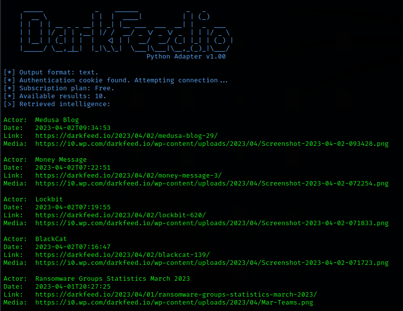
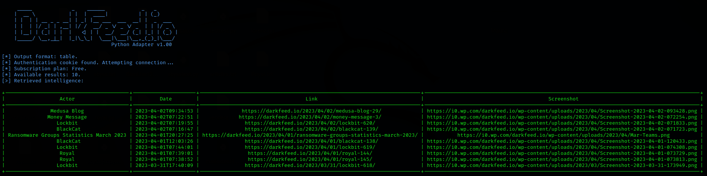

# DarkFeed Adapter
REST-API Adapters for DarkFeed.io By Mauro Eldritch (Birmingham Cyber Arms LTD)







# About DarkFeed.io Adapters

This repository contains Ruby and Python adapters for DarkFeed's API, which work with any kind of subscription (Free/Premium).

# Requirements

Each adapter has its own requirements which can be easily installed following the guideline below:

## Python Adapter
*Tested on Python 3.10.9*

```bash
cd python-adapter/
pip install -r requirements.txt
```

## Ruby Adapter
*Tested on Ruby 3.0.5*

```bash
cd ruby-adapter/
bundle install
```

# Configuration files

Each adapter has its own configuration file which is imported before running. In order for the adapter to work you need to specify your DarkFeed cookie (instructions on how to do this can be found on DarkFeed's website). 

Your cookie should look like this: `wordpress_logged_in_6322aa0fae1896447a522bb81b4843c7=User12%7C16832429688%7C.................`. Place that entire string inside the cookie variable and the adapter is ready for use.

# Output options

All adapters support multiple output options:

- json: raw JSON "as is". The exact output received from the API.
- text: plain text output separating fields by line breaks, and incidents by a double line break.
- yaml: a valid YAML output nesting every item inside a top category named "incidents".
- table: a visual table generated by different libraries depending on the adapter's language.
- csv: a comma separated output with heading.
- pdf: a pdf report, may require `wkhtmltopdf` to be installed on some distros.

Also, all of the above support different output channels:

- stdout: printing the desired format to your terminal (except for PDF which automatically defaults to "file").
- file: writing the desired format to a file named "darkfeed_output.txt".

# Directory structure

- python-adapter: Python files.
- ruby-adapter: Ruby files.
- report-templates: HTML report templates which are later converted to PDF.
