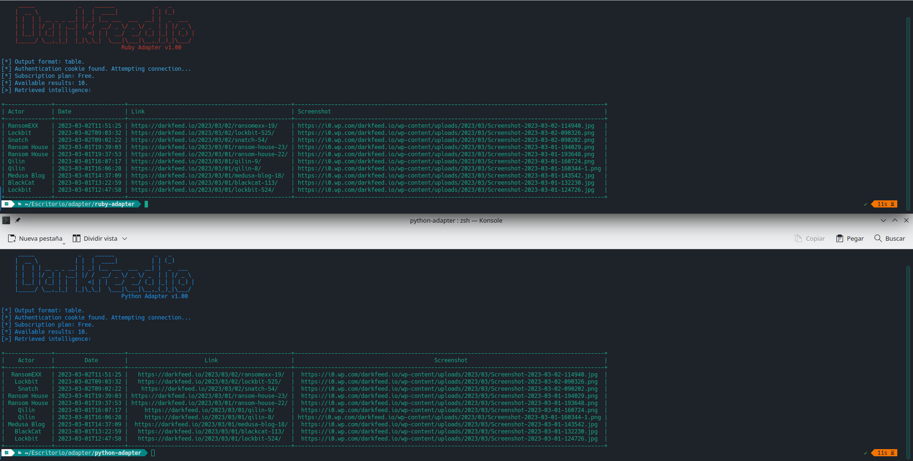

# DarkFeed Adapter
REST-API Adapters for DarkFeed.io
# About DarkFeed.io Adapters





This repository contains Ruby and Python adapters for DarkFeed's API, which work with any kind of subscription (Free/Premium).

# Requirements

Each adapter has its own requirements which can be easily installed following the guideline below:

## Python Adapter
*Tested on Python 3.10.9*

```bash
cd python-adapter/
pip install -r requirements.txt
```

## Ruby Adapter
*Tested on Ruby 3.0.5*

```bash
cd ruby-adapter/
bundle install
```
